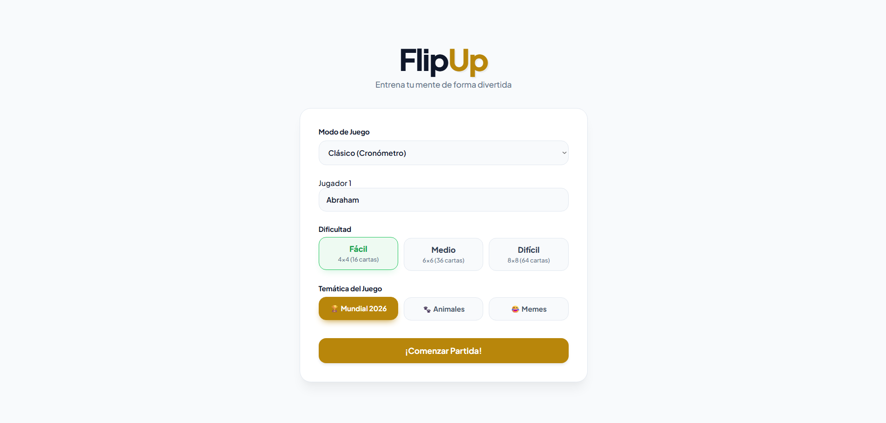
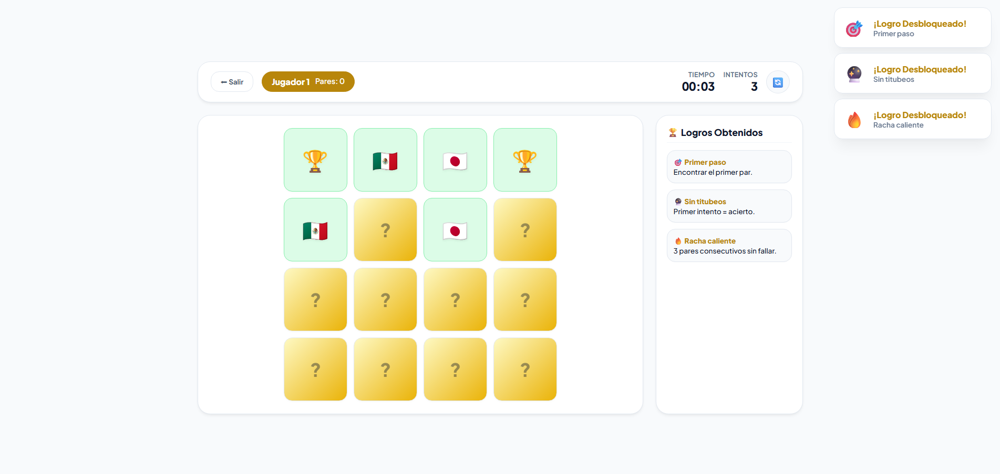
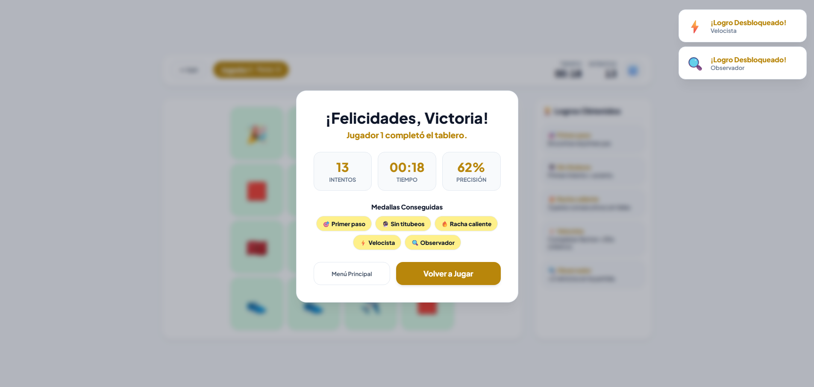

# 🧠 FlipUp - Memory Match Game

   

**FlipUp** es un juego de memoria visualmente atractivo desarrollado con tecnologías web nativas (HTML5, CSS3 y JavaScript vanilla). Ofrece múltiples modos de juego, temáticas y un sistema de logros que recompensa el desempeño del jugador.

---

## 🎯 Modos de Juego

| Modo | Descripción |
|------|-------------|
| **Clásico (Cronómetro)** | Un jugador. El cronómetro avanza. ¡Compite por tu mejor tiempo! |
| **Contrarreloj Extremo** | Tiempo límite según dificultad (60s/120s/180s). ¿Podrás vencer al reloj? |
| **Versus (1 vs 1)** | Dos jugadores se turnan en el mismo dispositivo. ¡El que más pares encuentre gana! |
| **Práctica Libre** | Sin presión. Sin tiempo. Ideal para entrenar la memoria. |

---

## 🎨 Temáticas Visuales

FlipUp incluye **3 temáticas** que cambian los colores y los iconos de las cartas:

- 🏆 **Mundial 2026**: Banderas de los paises del mundial, trofeos, balones... trae el espiritu de este Mundial 2026!
- 🐾 **Animales**: Perros, gatos, leones, unicornios... basicamente un zoologico de diversión.
- 😂 **Memes**: ¡Puro meme!

---

## 🏆 Logros Desbloqueables (14 en total)

Durante la partida podrás conseguir estas insignias:

| Logro | Icono | Condición |
|-------|-------|-----------|
| Primer paso | 🎯 | Encontrar el primer par |
| Racha caliente | 🔥 | 3 pares consecutivos sin fallar |
| Velocista | ⚡ | Completar fácil en menos de 30s (modo clásico) |
| Sin titubeos | 🔮 | Acertar en el primer intento |
| Messiiiiii! | 🐐 | Encontrar las cabras en el tema Mundial |
| Mente Maestra | 🧠 | Partida sin errores |
| Perfecto Imposible | 💀 | Modo difícil sin errores |
| Duelo de titanes | 🎩 | Ganar PvP por 1 par de diferencia |
| Empate perfecto | 🤝 | Empatar en PvP |
| Zoológico | 🦁 | Completar el tema Animales |
| Meme Lord | 😂 | Completar el tema Memes |
| Rey del tablero | 👑 | 10 pares seguidos sin fallar |
| Cold streak | 🧊 | Fallar 5 veces consecutivas |
| Observador | 🔍 | Usar el botón reiniciar menos de 2 veces |

---

## 👥 Integrantes y División de Trabajo

| Integrantes |
|--------|
| **Abraham Almeida** |
| **Carlos Esis** |

> ⚠️ **Nota importante:** Ambos nos turnamos las responsabilidades a lo largo del proyecto, colaborando en cada etapa. Todas las decisiones de diseño, arquitectura y funcionalidades fueron tomadas en conjunto, aportando ideas y soluciones de manera equitativa.

---

## 🚀 Cómo Ejecutar el Proyecto

1. Clona el repositorio o descarga los archivos.
2. Abre el archivo `index.html` en cualquier navegador moderno (Chrome, Firefox, Edge, Safari).
3. **No requiere servidor ni instalación.** Todo funciona desde local.

> 💡 *Para una mejor experiencia, usa auriculares. Los efectos de sonido están integrados.*

---

## 📁 Estructura del Proyecto
```
📦 FlipUp
┣ 📄 index.html
┣ 📁 css
┃ ┗ 📄 styles.css
┣ 📁 js
┃ ┣ 📄 app.js
┃ ┣ 📄 menu.js
┃ ┣ 📄 board.js
┃ ┣ 📄 game.js
┃ ┣ 📄 modes.js
┃ ┣ 📄 timer.js
┃ ┣ 📄 dashboard.js
┃ ┣ 📄 achievements.js
┃ ┣ 📄 themes.js
┃ ┣ 📄 audio.js
┃ ┗ 📄 endScreen.js
┗ 📁 assets
┗ 📄 messisound.mp3 
```
## 📸 Capturas de Pantalla 





## 📝 Créditos

Proyecto realizado con ❤️ por **Abraham Almeida** y **Carlos Esis** para la materia **Lenguajes de Clientes Web**, impartida por el **Ing. Victor Kneider**.